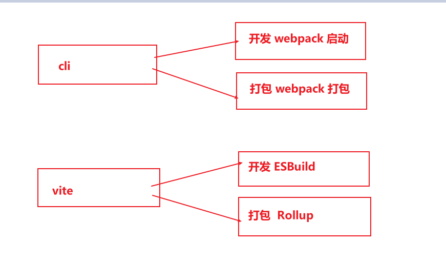

# vue3 基础讲解 - 课件 - 代码


## 基础

### 资料介绍

发下去资料,使用Live Server启动起来课件,介绍vue3

vue3 + TS，不是固定搭配，搭配到一起就是地狱开局

先讲vue3，后续用到TS再去加

> 注意: TS中最重要的就是接口和泛型

原理:

* proxy代理defineProperty实现响应式
* Tree-Shaking

特性:

* Componsition Api


### 插件介绍:

Vetur是vue2的,需要禁用
Vue Language Features(Vloar)
TypeScript Vue Plugin(Vloar)


### 创建项目
* cli创建项目
  ```js
  npm install -g @vue/cli     安装或者升级(保证 vue cli 版本在 4.5.0 以上)
  vue --version
  vue create my-project
  ```

* vite创建项目

  ```js
  npm init vite-app <project-name>
  cd <project-name>
  npm install
  npm run dev
  ```

构建工具 - cli 和 vite 差异

cli使用webpick,开发环境启动项目相当于从入口文件一点点找依赖构建

vite直接交给浏览器来做这些包的导入(有点像按需加载),vite快的原因多多重叠加出来的,这只是一个因素,最主要的因素是开发环境使用的是 ESBuild 这个东西,ESBuild 底层使用的是go语言写的,充分利用了cup的多线程(开发环境用的ESBuild,生产环境打包用的Rollup<打包工具>, Rollup并没有那么快,以后不排除在生产环境也用ESBuild)  




入口文件也变了,cli的入口文件还是在public下,vite的入口文件在根目录下
先用cli再, 后续用vite, 都去用用


### setup和ref - count案例(从vue2写法往vue3推导)
setup

```
执行时机: setup 代替了之前vue2的 beforeCreate 和 created 钩子,最早执行的钩子
特点: 在setup当中获取不到this
说明: [以后]所有页面中用到的东西都写在setup这个钩子中return出去
```

ref

```
1. 页面中使用的数据需要用ref包裹一下,变成一个响应式对象,然后return出去
2. 在页面中使用这个数据的时候直接 在插值语法中写这个数据即可,页面中自动会展示这个对象的.value属性
3. 在js中修改ref包裹的数据的时候,需要.value取修改
```


### reactive - 普通对象和reactive对象属性修改(使用字符串拼接)
obj是元对象、reactive代理、obj1是代理对象

```js
const obj = {
    name: '张三'
}

const obj1 = reactive(obj);
```

元对象经过 代理 生成了一个代理对象

代理对象是有响应式的,元对象没有

元对象修改的时候拦截不到设置值和获取值,代理对象在设置值和获取值的时候可以拦截到更新页面

修改代理对象本质上还是在修改元对象


#### ref和reactive区别

问题: ref和reactive都是把数据变成响应式,有什么差别?(基本数据类型、引用数据类型)

不同点:

1. ref可以用于基本数据类型,reactive不能用于基本数据类型
2. 对于引用数据类型来说,ref.value就是reactive包裹之后的代理对象
   相当于ref包裹对象的时候,将对象交给reactive包裹,返回的对象放在ref对象的value属性上
3. 在js中使用的时候,ref对象需要.value, reactive直接修改属性即可
4. ref对象.value属性改变的时候可以监测到,持有reactive对象的变量,修改地址之后,检测不到

> ref看着比reactive牛批


相同点:

1. 都可以把引用数据类型变成响应式
2. 在模板中使用的时候,都是直接使用

> 注意理解:当ref包裹一个对象的时候


### setup拓展 - 看看就行,不用记

正儿八经不会掺和着一块使用 组合式API 和 选项式API，以后全部写在 `<script setup lang="ts">`

setup(组合式API) 和 methods(选项式API) 配合使用

```
methods: {
    changeMessage () {
        console.log(this.message)
        this.message = "我爱你,高圆圆"
    },
}
```

setup(组合式API) 和 data(选项式API) 配合使用

```
setup() {
	const ins = getCurrentInstance(); // 获取到当前实例
	console.log(ins);
	const changeText = () => {
    	ins.data.text = "但是我们不合适"
	}
}
```

结论：在data和setup中如果有相同的数据,谁配置在后面展示的就是谁


### computed
函数写法
```js
vue2写法
computed: {
    fullName() {
         return firstName.value + '-' + lastName.value;
    }
}

vue3写法
const fullName = computed(() => {
    return firstName.value + '-' + lastName.value;
})
```

对象写法

```js
vue2写法
computed: {
    fullName: {
        get() {},
        set() {}
    }
}

vue3写法
const fullName = computed({
    get() {
        return firstName.value + '-' + lastName.value
    },
    set(val) {
        firstName.value = val.split('-')[0];
        lastName.value = val.split('-')[1];
    }
})
```


### watch 基本使用(参数讲解)
 ```js
 watch(firstName, (nval, oval) => {
     fullName.value = nval + '-' + lastName.value
 }, { immediate: true, deep: true })
 
 watch(lastName, (nval, oval) => {
 	fullName.value = firstName.value + '-' + nval;
 }, { immediate: true })
 ```


### watch 进阶
* 基本数据类型

  ref对象监听的是ref对象的.value属性,不能直接监听 ref对象.value

* 引用数据类型

  watch监听obj对象(监听了个ref对象),ref对象监听的是ref对象的.value属性,地址不发生变化监听不到

  watch监听obj.value对象(监听了个reactive对象),此时属性发生变化的时候可以监听到

  watch监听obj.value.xxx(监听了个reactive对象下的具体属性),直接监听了个字符串,不能直接监听

总结: 在没有开启深度监听的情况下,watch监听的是当前对象的下一层属性(ref对象监听的是.value,reactive对象监听的是属性)

如何理解:监听ref对象的时候,ref.value这个值变化可以监听到,监听ref.value的时候,基本数据类型无法监听,引用数据类型监听的是reactive对象,属性变化可以监听到


开启深度监听会发生什么?监听ref的时候,当开启深度监听的,既可以监听到 .value中地址的变化,也可以监听到对象的属性变化

发现:监听的时候,新值和旧值都是 reactive 对象,想要看到的是属性字符串的新值和旧值,这个怎么办?

参数一变成一个函数(这个函数叫做getter函数),函数的返回值必须是想要监听的属性,此时可以直接获取到字符出啊的变化

```
watch(() => obj.value.name, (nval, oval) => {
	console.log('监听的是函数 -> ', nval, oval)
})
```

#### watch监听多个数据
第一个参数可以写成数组,只要数组中的值发生变化就可以监听到

```js
watch([firstName, lastName, age, hobby], (nval, oval) => {
    result.value = `我叫 ${ nval[0] }-${ nval[1] } ,今年 ${ nval[2] } 岁,爱好 ${ nval[3] }`
})
```

假设监听值有10个,数组中写的值也得有10个,这样数组太长了,也不好用?怎么办? watchEffect 解决

watchEffect - 上来默认就会执行一次处理函数

watchEffect直接写一个监听得处理函数,只要这个函数中用得到值发生变化就可以监听到,有点像computed

```js
watchEffect(() => {
    // 注意: watchEffect 是同步追踪依赖的,只有在第一次执行的时候可以异步
    result.value =  `我叫 ${ firstName.value }-${ lastName.value } ,今年 ${ age.value } 岁,爱好 ${ hobby.value }`
})
```


### 生命周期钩子函数

```js
    setup  -- 最早执行,获取不到this
    onBeforeMount
    onMounted - 异步,发请求...等
    onBeforeUpdate - 数据改变,DOM更新前会触发更新
    onUpdated - 数据改变,DOM更新后会触发更新
    onBeforeUnmount
    onUnmounted
```

卸载

1. 获取到实例调用 app.unmount(); app是整个vue实例,也可以是组件实例

2. 组件标签v-if为false隐藏组件得时候,也会触发卸载

   和vue2的差异: vue3中的卸载直接页面组件都没了


### 获取鼠标实时位置 - 需求

```tex
clientX & clientY
拿的是鼠标相对视口的水平距离和垂直距离，相对的是视口的左上角（以视口左上角为原点）
pageX & pageY
拿的是鼠标相对页面的水平距离和垂直距离，相对的是页面的左上角（以页面左上角为原点）
offsetX & offsetY
拿的是鼠标相对自身元素的水平距离和垂直距离，相对的是自身元素左上角（以自身元素左上角为原点）
```

```js
    setup() {
        const pageX = ref(0);
        const pageY = ref(0);
        const mouseMove = (e) => {
            const { pageX: x, pageY: y } = e;
            pageX.value = x;
            pageY.value = y;
        }
        onMounted(() => {
            document.addEventListener('mousemove', mouseMove)
        })
        onUnmounted(() => {
            document.removeEventListener('mousemove', mouseMove)
        })
        return {
            pageX,
            pageY
        }
    }
```


### 自定义hook函数

封装上一个案例的获取鼠标实时位置

```js
import { ref, onMounted, onUnmounted } from 'vue'

// 需求:将获取鼠标实时位置的功能封装成一个hook函数
// 这里单独的功能封装到一个hook函数中,把需要的结果return出去
// 在需要使用这个功能的时候引入这个函数即可
// 自定义hook函数用来替代之前vue2当中的mixin
const getMouseLocation = () => {

    const pageX = ref(0);
    const pageY = ref(0);

    const mouseMove = (e) => {
      // 解构,解构出pageX然后给pageX起了一个别名为x
      const { pageX: x, pageY: y } = e;
      
      pageX.value = x;
      pageY.value = y;
    }

    // 挂载
    onMounted(() => {
      document.addEventListener('mousemove', mouseMove)
    })

    // 销毁 - 解绑事件
    onUnmounted(() => {
      document.removeEventListener('mousemove', mouseMove)
    })

    return {
        pageX,
        pageY
    }
}
export default getMouseLocation
```

使用

```js
import mouseLocation from './mouseLocation.js'
const { pageX, pageY } = mouseLocation()
```


### 获取页面种的元素 - input聚焦

获取页面中的元素步骤

1. 给页面中元素设置ref属性
2. 在setup函数中必须有和 标签上ref属性值一样的 return返回的属性即可


### toRefs

需求: 这里使用的属性是obj.name,觉得写的有点长,可不可以直接展示name呢?

可以,直接在return当中展开obj,把name和age给抛出去让模板使用,但是这里name和age不是一个响应式数据

我们希望它变成一个响应式数据,怎么办? 使用 toRefs

```js
const obj = reactive({
  name: '张三',
  age: 33
})
console.log( obj )

const obj1 = toRefs(obj); // 此时
console.log( obj1 )
```

结论：toRefs 把对象属性的非响应式变成了响应式数据,但是属性还是之前对象的属性


### vue3、vue2响应式原理

* Proxy - MDN
* Object.defineProperty()


## todolist

构建项目

```
npm init vue@latest
```

一路回车,加TS,其他不要,创建项目,创建完成项目之后,把没有用的东西都删掉

### 静态页面展示

拆分组件,把静态粘贴到项目进行拆分

注意: setup钩子变成开了script,这个script标签中的内容就是setup,写在这个script标签的变量和函数可以直直接在模板中使用

### 数据展示
app组件中使用ref创建一个数据,使用defineProps传参(数组、对象、配置对象)

Main组件 - Item组件展示 - 选中状态,文本

Footer组件展示 - 全选(computed),选中个数,总个数

注意:飘红一会添加TS类型

### 添加TS类型(重要)
​    泛型: 定义的时候定义泛型,使用的时候确定翻新
​    泛型函数:

    ```
      // ES5写法
      function fn (arg: T) {}
      function fn (arg: T): T {}
      function fn<T> (arg: T): T {}
        
      // ES6写法
      const fn: (a: number) => number = (arg) => arg
      const fn: <T>(a: T) => T = (arg) => arg
    ```

ref点进去看一下,知道是泛型,加TS类型

### Header 添加交互

在输入框中输入内容，点击回车的时候，收集到输入的内容，生成一个数据，把数据添加到父组件的list当中

addTodo交互函数传参,如果需要去重把 todos 传过来也

defineProps 添加TS类型,小括号中不写内容

```js
defineProps加TS类型写法

const props = defineProps<{
  todos: TodoModel[],
  addTodo: (arg: TodoModel) => void
}>()
```


### Main-Item  交互

* Item选中状态

  ```html4
  <input type="checkbox" :checked="todo.isSel" @change="changeHandler"/>
  
  <script setup lang="ts">
  const changeHandler = (e: Event) => {
    props.checkTodo(props.index, (e.target as HTMLInputElement).checked)
  }
  </script>
  ```

  1. 当点击item的时候,应该修改app组件中的数据,直接使用v-model修改是可以修改的,因为拿的是一个对象里面的属性 `todo.isSel` ，但是违反了单向数据流原则

  2. 当 checkbox 的值发生变化的时候，触发 `change` 事件的回调，在执行回调中写的 形参e会飘红，需要定义类型，如何记事件的类型?

     所有系统内置的事件类型的参数,都内置了TS类型,不需要都记住,只要记住一个就行 Event

     使用 'crtl + 鼠标左键' 点类型的文件中去,全局找 所有事件对象的类型声明,找到自己相对应的类型即可

     所有事件类型声明位置 在 5700 行左右

     `e.target` 也会飘红，加断言，断言成一个 元素的类型，元素的类型怎么记?

     每个标签元素都有类型,记不住,记一个 HTMLInputElement,

     使用 `crtl + 鼠标左键` 类型的文件中去,全局找 HTMLInputElement, 找到所有标签类型声明的位置,找到自己想要的类型即可

     所有标签类型声明位置 在 17630 行左右

* Item移入,移出删除按钮显示

  > 注意: 需要把 按钮上的 `style="diaplay: none"` 删除掉，还需要把 css 中 `li button` 中的 `diaplay: none`

  移入移出使用一个变量来控制即可

  ```html
  <li @mouseenter="isShow = true" @mouseleave="isShow = false">
    ......
  </li>
  
  const isShow = ref(false);
  ```

* Item删除

  点击删除按钮，触发从 app 传到 main 组件的，main组件传给 item 的 `deleteTodo` 函数即可，调用函数的时候，把下标传过去，告诉app组件要删除哪一个成员即可

### Footer 交互

* 全选交互(computed)

  ```js
  <input type="checkbox" v-model="isSelAll"/>
  
  const isSelAll = computed({
    get() {
      const isCheck = props.todos.every((item: TodoModel) => {
        return item.isSel
      }) && !!props.todos.length // -------- 这里!! 双感叹号是为了强制转成布尔值
      return isCheck
    },
    set(val) {
      props.checkTodoAll(val)
    }
  })
  ```

* 删除选中

  直接调用父组件中传过来的方法即可

  ```js
  <button class="btn btn-danger" @click="clearTodo">清除已完成任务</button>
  
  const props = defineProps(['todos', 'checkTodoAll', 'clearTodo'])
  ```

### 数据持久化

使用 localStorage 存 JSON

本地存储的和特点? localStorage 和 sessionStorage 差异?

本地存储大约可以存储5M左右的内容，只能存字符串(JSON可以理解为JSON字符串)，不能存对象数组这些东西

localStorage 本地永久存储，自己不删除，永远不会删除

sessionStorage 临时会话存储，当浏览器关闭的时候，sessionStorage 存储的内容会消失

> 拓展:
>
> 当 localStorage 存一个对象的时候，此时这个对象不是一个字符串，而我们 `localStorage.setItem('key', 参数二)` 参数二期望放一个字符串，此时会把 这个对象转成字符串，转成字符串的规则是 对象调用了 `toString()` 方法，将对象转成了 `'[object Object]'` ，不管对象中有什么内容，只要调用 `toString()` 方法都是  `'[object Object]'`
>
> 数组在 localStorage 存储的时候也会调用 `toString()`
>
> 数组在 localStorage 存储的时候也会调用 `toString()`
>
> 问: 什么情况下 引用数据类型会调用 toString() ?
>
> 当引用数据类型需要变成一个基本数据类型的时候，会调用 `toString()` 方法，例如:引用数据类型的运算
>
> ```js
> let obj = {name: '张三', age: 18}
> let arr = ['张三', '李四']
> obj + arr   //  --->   '[object Object]张三,李四'
> ```


## 路由案例

构建项目

```
npm init vue@latest
```


初始化页面准备

需要把静态页面的 css 引入到 入口文件 index.html 中

```html
  <link rel="stylesheet" href="./public/bootstrap.css">
  <style>
      .list-group-item {
        position: relative;
      }

      .btn {
        width: 80px;
        height: 30px;
        position: absolute;
        right: 0;
        bottom: 5px;
      }
  </style>
```

把html整个粘贴到 App.vue 文件中，让项目页面可以展示出来，为之后使用路由进行准备(接下来要使用路由对页面尽心拆分，如果页面显示不出来，拆分个屁)


使用 vue-router

### 一级路由拆分

```js
1. 安装
    npm i vue-router
2. 引入
    import { createRouter } from 'vue-router'
3. 创建并暴露
    createWebHashHistory() -> 'hash'模式
    createWebHistory()  -> 'history'模式

    const router = createRouter({
        history: createWebHistory(), 
        scrollBehavior(to, from, savedPosition) { // 滚动行为
            return { top: 0 }
        },
        routes: []
    })
    export default router
4. 创建vm实例的时候挂载
    app.use(router)
```

```js
书写页面的步骤:
一、拆分页面步骤(静态页面搭建):
1. 定义 - 创建.vue文件,把模板和css粘贴进去
2. 注册 - 路由组件注册在路由器的 routes 当中, 而普通组件注册有全局注册和局部注册两种
3. 使用 - 
    路由组件的使用,考虑两个点: 1. 点击的位置使用 router-link 2. 渲染的位置使用router-view
二、初始化数据展示
三、交互
```

> 注意: 一级路由拆分注意有redirect重定向


### 二级路由拆分

步骤和一级路由的拆分一样

注意: 二级路由拆分重定向不再支持简写

注意: 组件中使用vue3提供的路由组件 `import { RouterLink, RouterLink } from 'vue-router'`


### 三级路由传参

#### megDetail

router-link使用数据循环渲染出来，当点击 router-link 的时候，需要携带参数到 megDetail 页面，参数携带使用 params 和 query

1. 传参

   声明式导航传参

   ```html
   <router-link :to="`/home/message/msgDetail/${ msg.id }?content=${ msg.content }`">{{ msg.content }}</router-link>
   ```

   * id 使用params传参

     ```js
     {
         path: 'msgDetail/:id?', // :id是给params参数占位,?是可传可不传
         component: () => import('@/pages/MsgDetail/index.vue'),
     }
     ```

   * content 使用 query 传参 - 直接传即可

2. 接参

   ```js
   路由组件中
   
   div>{{ Route.params.id }}</div>
   div>{{ Route.query.content}}</div>
   
   import { useRoute } from 'vue-router'
   const Route = useRoute(); // 获取到当前页面的路由
   ```

   

> 拓展：
>
> 在路由传参的时候，可以将传递的参数映射到组件中props，在路由中配置props属性即可
>
> 路由中
>
> ```js
> {
>     path: 'msgDetail/:id?', // :id是给params参数占位,?是可传可不传
>     component: () => import('@/pages/MsgDetail/index.vue'),
>       
>     // props有三种配置:
>     // 1. props配置布尔值
>     //    props配置布尔值的时候,只能把路由中的params参数映射到组件的props属性中
>     props: true,
>   
>     // 2. props配置对象形式
>     //    props配置对象形式,可以将额外的参数映射到组件中的props,但是接收不到params和query参数
>     //    对象的这种配置形式的目的就是为了添加额外的参数到组件
>     props: {
>       text: '我爱你'
>     }
>     
>     // 3. props配置函数形式
>     props(route) { // 这个飘红是因为类型问题,后续我们加类型
>       return {
>         id: route.params.id,
>         content: route.query.content,
>         text: '你是个好人' // 额外的数据
>       }
>     }
> }
> ```
>
> 组件中
>
> ```js
> defineProps(['id', 'content', 'text'])
> ```


#### newsDetail

关注两个点:

1. 编程式导航

   ```js
   import { uesRouter } from 'vue-router'
   const Router = uesRouter(); // 拿到的是路由器对象(router)
   
   注意:
   使用编程式导航的时候,传参有多种方式
   
   字符串传参
   Router.push(`/home/news/newsDetail/${ news.id }?content=${ news.content }`)
   
   对象传参
   当使用params传参的时候,path不好使,传不过去,需要使用name来传参
   这个name必须和路由中的nema相同
   Router.push({
       name: 'NewsDetail',
       params: {
           newsId: news.id
       },
       query: {
           content: news.content
       }
   })
   ```

2. 接收参数

   ```js
   import { uesRoute } from 'vue-router'
   const Route = uesRoute();
   ```

   


### 添加TS类型

当前案例中，添加TS类型考虑两个位置:

1. 三级路由传参的时候，需要给数据设置类型

   ```js
   export interface Model {
     id: number,
     content: string
   }
   
   const msgList = ref<Model[]>([
     { id: 1001, content: '1月22过年' },
     { id: 1002, content: '1月14放假' },
     { id: 1003, content: '5点放学' },
   ])
   ```

2. router中的routes需要设置类型

   在写路由的时候，routes是需要类型，最早是一个空数组的时候，会飘红，鼠标移上去看这个飘红，看第三方插件提示的内容，会告诉我们缺失的是什么类型，把这个类型从第三方插件中引入进来，直接使用即可

   ```js
   import type { RouteRecordRaw } from 'vue-router' 
   
   const routes: RouteRecordRaw[] = [
       {
           ......
       }
   ]
   ```

   


## pinia

count案例 - 未使用pinia

> 在todolist的about二级路由组件中写


count案例 - 使用pinia

```js
介绍pinia
1. 下载pinia
    npm i pinia
2. 引入pinia
    import { createPinia } from 'pinia'
3. 创建并暴露
    export default createPinia()
4. 创建vm实例的时候挂载
    import store from './store'
    app.use(store) // 这行代码一定要在 app.mount("#app")之前
```

具体步骤

```tex
// 创建 src/store/modules/countStore.ts 文件
import { defineStore } from 'pinia'
// 创建
// 参数一: 模块名(这里人家叫id)
// 参数二: 配置项(vue2中使用的时候是4个核心概念,现在只有三个了,没有了mutations,三连环变成二连环)
const useCountStore = defineStore('countStore', {
    state: () => ({})
    actions: {},
    getters: {}
})
export default useCountStore


// 使用
import useCountStore from '@/store/countStore'
countStore = useCountStore()
```

>  注意:
>
> 只要能够获取到 store ，直接就能修改数据
>
> 为什么还需要 actions 呢?
>
> 当页面中有多个按钮，点击的逻辑相同，都要去发请求的时候，如果把每个请求写在同的组件中，请求的代码就需要写好几遍，可以把请求放到 actions 中，拿到数据之后存储到 state 中


## 组件通信

### props - count案例
没有加TS限制类型的时候

```js
1. 数组写法
defineProps(['count', 'changCount'])
2. 对象写法
defineProps({
    count: Number,
    changCount: Function
})
3. 配置对象
defineProps({
    count: {
      type: Number,
      default: 2
    },
    changCount: {
      type: Function,
      required: true
    }
})
```

> 注意: defineProps()会返回一个对象,这个对象可以直接.出数据
>
> ```js
> const props = defineProps(['text'])
> 
> 接到数据之后模板中直接写数据即可
> 		    js中需要使用 props.text 来获取数据
> ```


加TS写法
```js
const props = defineProps<{
    count: number,
    // changCount: Function
    changCount: (n: number) => void // 定义到函数中具体的某个参数
}>()
```


规则:

```tex
非函数类型
	基本数据类型 - 展示
	引用数据类型 - 展示,但是可以修改属性,不推荐(违反单向数据流 - 不是绝对禁止使用的,偷懒可以用)
函数类型 - 子组件调用父组件传过来的函数,修改父组件的数据
```


### 自定义事件 - click事件,xxx事件
两个角度分析

* 元素绑定

  * 绑定原生事件   --   关注 事件类型(系统内置事件) 和 触发机制(浏览器触发)
  * 绑定自定义事件 -- 无意义，没有触发机制

* 组件绑定

  * 绑定原生事件

    v2中所有绑定在组件标签上的原生事件都会被理解成自定义事件,需要使用.native才能转成原生事件

    v3中所有绑定在组件标签上的原生事件会自动绑定到子组件的根标签上, .native被移出了

    v3注意两个:

    ​		没有根标签,原生事件将变成自定义事件

    ​		有根标签,但是使用 defineEmits 接收过,也是自定义事件 

  * 绑定自定义事件

    需要自己绑定,自己触发


总结:

```tex
在vue2中给组件绑定的事件都是自定义事件,通过.native可以把像click这种转成原生事件
在vue3中给组件绑定事件需要区分,像click这种事件,直接就是绑定的原生事件,绑定到组件的根标签身上
    这里移除了.native,
    1. 如果子组件没有根标签,此时这个click事件就变成了自定义事件,需要使用emit触发
    2. 如果子组件中使用 defineEmits 接收过绑定的事件,一定是自定义事件
```

写法:

```js
不加TS类型
    const emit = defineEmits(['click', 'xxx'])

加TS类型
    const emit = defineEmits<{
        (e: 'xxx'): void
        (e: 'customeEvent', arg: number): void
    }>()
	// 使用
	emit('xxx')
	emit('customeEvent', 22)

	注意: 在 defineEmits 中定义函数的时候 `(e: 'xxx'): void` 里面的e是一个参数,类型是一个具体的值,原理和 const a: '我爱你' = '我爱你' 一样，相当于给 e 设置了一个值类型，值类型也是一个类型
```

> 注意:在vue2中和vue3中的$event都是一样的


### pubsub

```js
1. 安装
    npm i pubsub-js
2. 接收参数的组件,订阅消息(绑定事件),留下回调,接收参数
    Pubsub.subscribe('changeMessage', changeMessage)
3. 发送参数的组件,发布消息(触发事件),传递参数
    Pubsub.publish('changeMessage', 'string')
```

> 注意:
>
> pubsub的接收参数回调中，参数一是消息类型，参数二才是我们正儿八经传递的参数

#### declare 在 .d.ts 文件进行全局类型声明

```js
注意: 使用第三方包有时候可能回飘红,因为第三方包没有兼容TS类型,需要自己手动声明
env.d.ts文件声明类型、模块、接口的(告诉TS的)

declare module 'pubsub-js' // 告诉TS pubsub是一个模块,直接用即可,TS就不会飘红了

// declare相当于声明了一个类型
// 这里的abc可以理解成等号右侧的类型别名
declare type abc = '我爱你' | undefined

// declare声明一个接口
declare interface qwer {
  name: string
}

因为这些声明在 .d.ts 文件中,所以全局可以使用
```


### v-model

思路: 从vue2一步步推出vue3的v-model

CustomInput
        v-model 用于收集表单数据,用于组件是父子组件之间的数据同步
        在vue2当中v-model是通过两个条件  1. :value  2. @input实现的
        在vue3当中猜测也是这两个条件实现的
        结论:vue3中不是这两个条件


CustomInput2
        那么vue3是如何实现的?
        vue3 v-model 是通过  :modelValue 和 @update:modelValue 实现的
        vue3把.sync移除了,相当于把v-model和.sync统一成一个了
        `<CustomInput2 :modelValue="message" @update:modelValue="message = $event"></CustomInput2>`
        `<CustomInput2 v-model:modelValue="message"></CustomInput2>`
        `<CustomInput2 v-model="message"></CustomInput2>`
        注意: 这里只有 绑定的是modelValue可以简写


CustomInput3
        为什么把v-model和.sync统一了?
        在vue2中v-model组件只能绑定一个,.sync可以绑定多个
        vue2中v-model的实现必须是 :value 和 @input,绑定value只能绑定一个value
        vue2中.sync的实现:xxx  和 @update:xxx 没有限制几个数据,想绑定几个就绑定几个
        在vue3当中,一个组件可以使用多个v-model了,封装一个 CustomInput3 中写多个input框
        `<CustomInput3 v-model="message" v-model:text="text"></CustomInput3>`


### attrs

vue2中 $attrs,获取到除去props接收过的属性,class、style,其他属性都可以接收到

vue2中 $listener,可以获取到所有的自定义事件


vue3中,$listener移除了

vue3中的attrs使用

```js
1. 引入 useAttrs
    import { useAttrs } from 'vue'
2. 调用 useAttrs 方法得到一个对象
    const attrs = useAttrs();
这个对象可以接收到除了 props已经接收过的数据 和 emit接收过的事件 ,其他的都可以接收到(包括绑定的属性和事件)
(注意:这里class和style的样式会被应用于子组件)


需求: 封装HintButton组件,一个带有提示的button组件(使用 element)
    el-button 组件中的配置项多了,一个一个暴露吗?
    不是,使用 attrs 得到传进来的属性和方法,绑定到el-button组件上,作用于el-button这个组件
    通过 v-bind="attrs" 把接收到的属性和事件都绑定到el-button组件上
```


### ref-parent - 借钱案例
总结

1. ref - 拿组件实例-拿元素

   声明的变量必须和组件上的ref属性值相同才能拿到组件实例

   组件实例中的内容是看不到的,需要使用 defineExpose({ money }) 暴露才可以被外部观看到

2. $parent 没有移除  $children被移除了

   $parent通过模板传参可以获取到 父组件


### provide-inject

vue2中 
        provide广播,只有初始化的时候广播一次,之后数据发生改变的时候后面接收不到
        除了对象的属性,对象的地址改变后代接收不到,对象的属性改变后代能接收到

vue3
        vue3中的数据ref对象、reactive对象都是对象,对象的属性变化(ref对象的.value属性)后代能拿到
        provide广播对象的对象是proxy对象,不处理,不是proxy对象,用reactive处理一下变成proxy对象

```js
import { provide } from 'vue';
provide('content11', content11)

import { inject } from 'vue'
const content11 = inject('content11')
```


总结: vue3中数据的变化后代是可以拿到的(因为广播出去的都是对象)


### slot - 正常写就行
